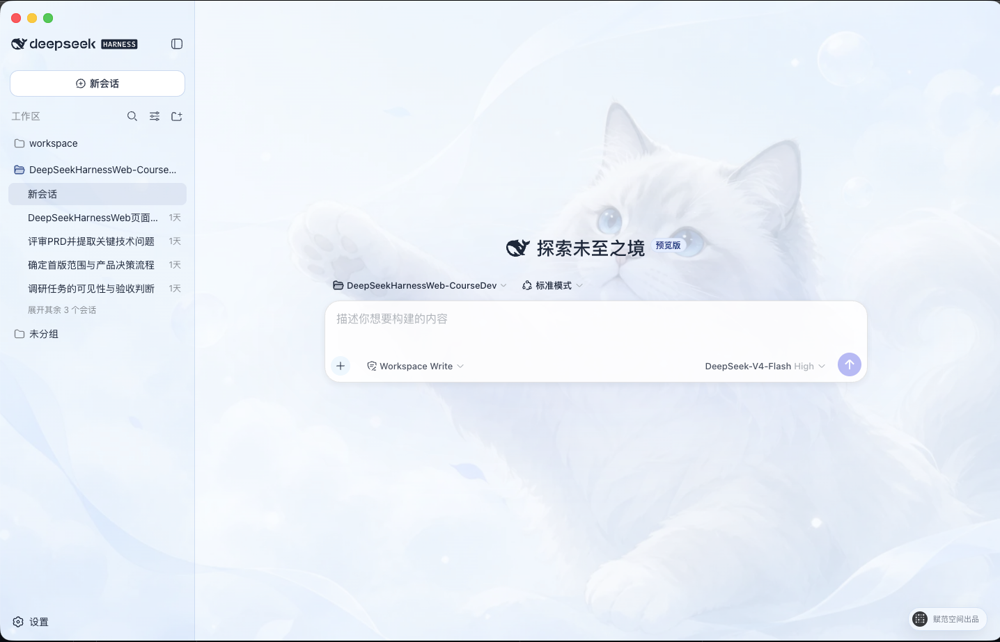

# DeepSeek Harness Desktop

[中文](README.md) | English

A desktop project developed from the [DeepSeek Harness](https://github.com/deepseek-ai/deepseek-harness) source code for developers who want to download, modify, run, and extend the application locally.

<p align="center">
  
</p>

## At a glance: available features and near-term roadmap

> The desktop development workspace and Chinese DeepSeek controls are available today. Features marked "In development" or "Planned" are not yet available and will be updated only after the corresponding workflow is runnable.

| Capability | Status | What it enables |
| --- | --- | --- |
| **Desktop development workspace** | ✅ Available | Open local projects, manage sessions and workspaces, use Harness models, tools, Skills, and plugins, and modify the complete source code directly. |
| **Chinese DeepSeek controls** | ✅ Available | Choose Chinese permission levels and DeepSeek-specific thinking modes directly in the composer for the current session. |
| **Plugin Center** | 🚧 In development · **expected within 1 day** | The first usable release brings plugin discovery, search, categories, details, an installation entry, and result feedback into one desktop view. Composition, removal, updates, and compatibility checks follow in later releases. |
| **MCP, Skills, and tool extensions** | 🗓️ Planned | Discover, connect, and manage MCP servers, Skills, and tools in the desktop app, then compose Agent capabilities for each project. |
| **Agent presets and multi-Agent collaboration** | 🗓️ Planned | Define Agents and subagents that collaborate across coding, testing, research, and review work. |
| **Planning, background runs, and session recovery** | 🗓️ Planned | Manage plans and tasks, keep long-running work active in the background, inspect progress, and resume previous sessions. |
| **Project rules, hooks, and durable memory** | 🗓️ Planned | Manage repository instructions, automation hooks, and reusable context so Agents work consistently with project rules. |
| **Git, worktrees, and code review** | 🗓️ Planned | Develop concurrently in isolated worktrees, inspect diffs, commits, and review results, and reduce interference between tasks. |
| **Browser and desktop automation** | 🗓️ Planned | Let Agents operate websites and local applications, then verify completion through real interaction results. |
| **Mobile remote access and channels** | 🗓️ Planned | Inspect and resume tasks from a mobile device, and receive notifications or trigger Agents through common messaging channels. |

## Project overview

DeepSeek Harness Desktop uses Electron to host the DeepSeek Harness Web workspace. The desktop main process starts and manages a local `dsh web` service. This repository provides the complete development source so users can clone or download it, install dependencies, edit the code, launch the desktop app, and continue development.

This README documents source access and development only. It does not provide a third-party download site or unconfirmed installer information.

## Core features

- **Electron desktop app**: application window, system tray, single-instance behavior, external-link handling, and a restricted preload bridge.
- **Local Harness Host**: the desktop main process starts `dsh web`, waits for the local service to become ready, and stops the Host process when the app exits.
- **Web workspace**: DeepSeek Harness sessions, workspaces, models, tools, Skills, and plugin runtime remain available.
- **Desktop appearance settings**: local background images and related display settings; the screenshot on this page shows the project interface.
- **Complete development source**: desktop app, Web interface, CLI, capability packages, native helpers, Python SDK, examples, and build scripts are kept in the repository.

## Chinese permissions and DeepSeek model controls

- **Permission selection**: the composer uses the Chinese `只读`, `工作区写入`, and `完全访问` labels for the current session. General settings affect only new sessions, and enabling Full access requires an explicit risk confirmation.
- **Model and thinking modes**: the model and API key remain managed in Settings. The composer shows the current DeepSeek model and offers `关闭思考`, `深度思考`, and `最大思考` without inventing a speed setting that DeepSeek does not expose.

## Quick start

### Get the source

Clone the repository with Git:

```sh
git clone https://github.com/fufankeji/deepseek-harness-app.git
cd deepseek-harness-app
```

You can also choose **Code → Download ZIP** on the GitHub repository page, extract the archive, and open the project directory.

### Requirements

- Node.js `^22.19.0 || >=24.0.0`
- pnpm `11.7.0`

### External services

Downloading the source, installing dependencies, and launching the desktop development environment do not require an API key. Configure the selected model provider and credentials in the application settings only when making model requests, and never commit credentials to Git.

<a id="run"></a><a id="run-from-source"></a>

### Install and run

Install the workspace dependencies:

```sh
pnpm install
```

Build the required modules and launch the desktop development environment:

```sh
pnpm run dev:desktop
```

The development launcher rebuilds when relevant source or build inputs change. To force a complete rebuild, run:

```sh
pnpm run dev:desktop:rebuild
```

## Repository layout

```text
deepseek-harness-app/
├── apps/
│   ├── desktop/       # Electron main process, preload, Host lifecycle, and desktop build scripts
│   ├── web/           # DeepSeek Harness Web entry and desktop composition
│   └── cli/           # dsh CLI, runtime configuration, and Agent Presets
├── packages/          # Agent, model, tool, session, plugin, and client capability packages
├── native/            # Native sandbox helpers
├── python/            # Python SDK and related runtime
├── examples/          # Runnable examples and configurations
├── scripts/           # Build, validation, generation, and publishing scripts
├── website/           # Documentation site source
├── vendor/            # Pinned Cordis foundation source
└── assets/            # Project images used by the README
```

## Common development commands

| Command | Purpose |
| --- | --- |
| `pnpm run dev:desktop` | Build required modules and launch the Electron desktop app |
| `pnpm run dev:desktop:rebuild` | Force a complete rebuild before launching the desktop app |
| `pnpm run build` | Build the Host, client, Web, and desktop app |
| `pnpm run package:desktop` | Create an unpacked desktop app for the current platform |
| `pnpm run typecheck` | Run TypeScript type checks |
| `pnpm run test` | Run the Vitest unit suite |

## Suggested reading order

1. `apps/desktop/src/main.ts`: desktop entry, window, tray, and local Host composition.
2. `apps/desktop/src/host-supervisor.ts`: `dsh web` startup, readiness detection, and shutdown.
3. `apps/desktop/src/preload.ts`: fixed desktop interfaces exposed to the renderer.
4. `apps/web/`: the Web workspace loaded by the desktop window.
5. `apps/cli/` and `packages/`: CLI composition and Harness capabilities.

## Plugin Center (in development, expected within 1 day)

The first usable Plugin Center release will bring plugin discovery, search, categories, details, an installation entry, and result feedback into the desktop app, and is expected within one day. Composition, removal, updates, and compatibility checks will become available through later runnable releases; this page will add real screens and usage instructions as each capability ships.

## Relationship to DeepSeek Harness

This project continues desktop development from the Harness core, Cordis plugin system, and Web interface in [deepseek-ai/deepseek-harness](https://github.com/deepseek-ai/deepseek-harness). This repository maintains the Electron desktop entry, local Host management, desktop interactions, and supporting development scripts.

## License

This project uses the [MIT License](LICENSE). Third-party license information is available in [THIRD_PARTY_NOTICES.md](THIRD_PARTY_NOTICES.md).
