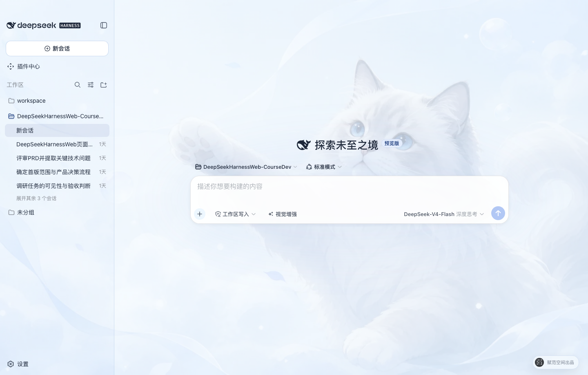

<p align="center">
  <a href="https://www.beyondata.com/">
    
  </a>
</p>

<h1 align="center">DeepSeek Harness Desktop</h1>

<p align="center">
  <a href="https://github.com/fufankeji/deepseek-harness-desktop/stargazers"></a>
  
  
  
  
  <a href="LICENSE"></a>
  
</p>

<p align="center"><a href="README.md">中文</a> · <strong>English</strong></p>

<p align="center"><strong>Built by Beyondata · A modern desktop development experience for the DeepSeek Harness ecosystem</strong></p>

<p align="center"><strong>Search, verify, install, and remove DSH plugins from the public ecosystem · Let DeepSeek understand images</strong></p>

<p align="center">DeepSeek Harness Desktop combines the local Web workspace, Host lifecycle management, and a native desktop window into a development environment that developers can download as source, modify directly, and continue building locally.</p>

<p align="center"><a href="https://github.com/fufankeji/deepseek-harness-desktop/releases"><strong>Download the macOS arm64 development preview</strong></a> · <a href="#quick-start"><strong>Get the source and start developing</strong></a></p>

<p align="center">
  
</p>

## At a glance: available features and near-term roadmap

> The desktop development workspace, public Plugin Center, and Chinese DeepSeek controls are available today. Features marked "In development" or "Planned" are not yet available and will be updated only after the corresponding workflow is runnable.

| Capability | Status | What it enables |
| --- | --- | --- |
| **Desktop development workspace** | ✅ Available | Open local projects, manage sessions and workspaces, use Harness models, tools, Skills, and plugins, and modify the complete source code directly. |
| **Vision enhancement** | ✅ Available | Add image understanding to a text-based DeepSeek workflow by reading conversation attachments and workspace images, then providing traceable observations to the Agent. |
| **Chinese DeepSeek controls** | ✅ Available | Choose Chinese permission levels and DeepSeek-specific thinking modes directly in the composer for the current session. |
| **Built-in skins and custom backgrounds** | ✅ Available | Start with the whale-maid skin, switch to Cloud Cat, or choose a local image and let the app adapt its interface palette. |
| **Public Plugin Center** | ✅ Available | Discover plugins and Bundle-wrapped Skill Packs carrying the `dsh-plugin` keyword in the public npm ecosystem, inspect details and risk, install them online, and enable, disable, or uninstall them. |
| **Standalone MCP, Skills, and tool management** | 🗓️ Planned | Add discovery and connection management for MCP servers, Skills, and tools that are not distributed as Bundles, then compose Agent capabilities per project. |
| **Agent presets and multi-Agent collaboration** | 🗓️ Planned | Define Agents and subagents that collaborate across coding, testing, research, and review work. |
| **Planning, background runs, and session recovery** | 🗓️ Planned | Manage plans and tasks, keep long-running work active in the background, inspect progress, and resume previous sessions. |
| **Project rules, hooks, and durable memory** | 🗓️ Planned | Manage repository instructions, automation hooks, and reusable context so Agents work consistently with project rules. |
| **Git, worktrees, and code review** | 🗓️ Planned | Develop concurrently in isolated worktrees, inspect diffs, commits, and review results, and reduce interference between tasks. |
| **Browser and desktop automation** | 🗓️ Planned | Let Agents operate websites and local applications, then verify completion through real interaction results. |
| **Mobile remote access and channels** | 🗓️ Planned | Inspect and resume tasks from a mobile device, and receive notifications or trigger Agents through common messaging channels. |

## Project overview

DeepSeek Harness Desktop uses Electron to host the DeepSeek Harness Web workspace. The desktop main process starts and manages a local `dsh web` service. This repository provides the complete development source so users can clone or download it, install dependencies, edit the code, launch the desktop app, and continue development.

Desktop installers are published only through this repository's GitHub Releases page, never through a third-party download site. Until the first platform-accepted build is published, users must launch the development environment from source.

## Core features

- **Electron desktop app**: application window, system tray, single-instance behavior, external-link handling, and a restricted preload bridge.
- **Local Harness Host**: the desktop main process starts `dsh web`, waits for the local service to become ready, and stops the Host process when the app exits.
- **Web workspace**: DeepSeek Harness sessions, workspaces, models, tools, Skills, and plugin runtime remain available.
- **Public Plugin Center**: search the public npm `dsh-plugin` ecosystem, verify the exact version, artifact integrity, Bundle declaration, and local compatibility before installation, then enable, disable, or uninstall entries from the Installed view.
- **Composer vision enhancement**: enable Bailian Qwen3.8 image understanding in one click for screenshots, photos, charts, OCR, and workspace images without replacing the current DeepSeek model.
- **Desktop appearance settings**: built-in Whale Maid and Cloud Cat skins, plus local backgrounds, subject focus, and interface glass controls.
- **Complete development source**: desktop app, Web interface, CLI, capability packages, native helpers, Python SDK, examples, and build scripts are kept in the repository.

## Built-in skins and custom backgrounds

Open **Settings → Background** to switch built-in skins. For a custom image, the app performs the 1920×1080 WebP crop and interface color adaptation locally without uploading the original.

<table>
  <tr>
    <td width="50%" align="center"></td>
    <td width="50%" align="center"></td>
  </tr>
  <tr>
    <td><strong>Whale Maid · Default</strong><br>Two blue-and-white whale assistants frame a bright palace while the center remains clear for conversation.</td>
    <td><strong>Cloud Cat</strong><br>The original soft blue-and-white cat theme remains available as a calm, low-distraction option.</td>
  </tr>
</table>

## Chinese permissions and DeepSeek model controls

- **Permission selection**: the composer uses the Chinese `只读`, `工作区写入`, and `完全访问` labels for the current session. General settings affect only new sessions, and enabling Full access requires an explicit risk confirmation.
- **Model and thinking modes**: the model and API key remain managed in Settings. The composer shows the current DeepSeek model and offers `关闭思考`, `深度思考`, and `最大思考` without inventing a speed setting that DeepSeek does not expose.

## Vision enhancement: let DeepSeek understand images

The text-based DeepSeek model used by the desktop workflow cannot interpret images directly. When vision enhancement is enabled, the built-in Bailian `qwen3.8-max` capability first reads image attachments or PNG, JPEG, WebP, and GIF files in the workspace, then gives the Agent a traceable visual observation. The existing DeepSeek model, permission level, and session flow remain unchanged.

- **Available in the composer**: use the “视觉增强” shortcut on the left side of the input bar; hover to see its purpose and current state.
- **Enabled through real verification**: the first activation verifies a Bailian API key with a real image; the credential remains in the protected local credential file.
- **Built for development work**: understand product screenshots, error dialogs, designs, charts, photos, and text in images, or inspect an image by its workspace path.

## Download the desktop app

> GitHub Releases provides a macOS Apple Silicon development-preview ZIP that has passed real Electron acceptance and requires no Node.js or pnpm installation. The current preview is not signed or notarized with an Apple Developer identity and is intended for development testing only. The formal release will still provide a signed macOS `.dmg` and Windows x64 `.exe`.

<p align="center"><a href="https://github.com/fufankeji/deepseek-harness-desktop/releases"><strong>Open the GitHub Releases download center</strong></a></p>

Development previews use a separate pre-release tag and include a SHA-256 checksum file without triggering the formal installer workflow. The formal workflow accepts only a `desktop-v*` tag that exactly matches the Desktop version, and publishes the macOS and Windows installers with `SHA256SUMS` only after both platform signatures pass verification.

## Quick start

### Get the source

Clone the repository with Git:

```sh
git clone https://github.com/fufankeji/deepseek-harness-desktop.git
cd deepseek-harness-desktop
```

You can also choose **Code → Download ZIP** on the GitHub repository page, extract the archive, and open the project directory.

### Requirements

- Node.js `^22.19.0 || >=24.0.0`
- pnpm `11.7.0`

### External services

Downloading the source, installing dependencies, and launching the desktop development environment do not require an API key. Configure the selected model provider and credentials in the application settings only when making model requests, and never commit credentials to Git.

<a id="run"></a><a id="run-from-source"></a>

### Install and run

Install the workspace dependencies:

```sh
pnpm install
```

Build the required modules and launch the desktop development environment:

```sh
pnpm run dev:desktop
```

The development launcher rebuilds when relevant source or build inputs change. To force a complete rebuild, run:

```sh
pnpm run dev:desktop:rebuild
```

## Repository layout

```text
deepseek-harness-desktop/
├── apps/
│   ├── desktop/       # Electron main process, preload, Host lifecycle, and desktop build scripts
│   ├── web/           # DeepSeek Harness Web entry and desktop composition
│   └── cli/           # dsh CLI, runtime configuration, and Agent Presets
├── packages/          # Agent, model, tool, session, plugin, and client capability packages
├── native/            # Native sandbox helpers
├── python/            # Python SDK and related runtime
├── examples/          # Runnable examples and configurations
├── scripts/           # Build, validation, generation, and publishing scripts
├── website/           # Documentation site source
├── vendor/            # Pinned Cordis foundation source
└── assets/            # Project images used by the README
```

## Common development commands

| Command | Purpose |
| --- | --- |
| `pnpm run dev:desktop` | Build required modules and launch the Electron desktop app |
| `pnpm run dev:desktop:rebuild` | Force a complete rebuild before launching the desktop app |
| `pnpm run build` | Build the Host, client, Web, and desktop app |
| `pnpm run package:desktop` | Create an unpacked desktop app for the current platform |
| `pnpm run typecheck` | Run TypeScript type checks |
| `pnpm run test` | Run the Vitest unit suite |

## Suggested reading order

1. `apps/desktop/src/main.ts`: desktop entry, window, tray, and local Host composition.
2. `apps/desktop/src/host-supervisor.ts`: `dsh web` startup, readiness detection, and shutdown.
3. `apps/desktop/src/preload.ts`: fixed desktop interfaces exposed to the renderer.
4. `apps/web/`: the Web workspace loaded by the desktop window.
5. `apps/cli/` and `packages/`: CLI composition and Harness capabilities.

## Public Plugin Center: discover, install, and remove online

Open **Plugin Center** from the sidebar to search plugins and Skill Packs in the public npm Registry that carry the `dsh-plugin` keyword and follow the DeepSeek Harness Bundle format. Packages without `dsh.bundle.patch`, an exact version, or trusted npm integrity metadata never enter the install path.

- **Discovery and detail**: switch between Plugins and Skills, search public entries, and inspect version, capabilities, permissions, compatibility, and risk. When the network is unavailable, the app can use the most recent locally verified cache and shows its freshness explicitly.
- **One-click online installation**: after you select Install, Desktop downloads the exact npm version and verifies package identity, integrity, the Bundle Patch, expected runtime evidence, and the local environment. Once confirmed, it updates the current Profile and restarts the Harness Host; completion appears only after the declared Host, client, or Skill evidence is active.
- **Installed management**: the Installed view distinguishes system, public-catalog, and local sources, and shows both Bundle enablement and current runtime state. Public-catalog plugins can be enabled, disabled, or uninstalled.
- **Safe removal**: uninstall removes the package and its active Bundle composition while retaining configuration and plugin data by default. After a successful uninstall, Desktop separately lists plugin-declared owned directories so the user can explicitly choose whether to remove them.

The shortest path is **Plugin Center → Search → Open details → Install and confirm → Wait for Host restart and runtime verification**. To remove an item, choose Uninstall from the installed entry or its action menu, then decide whether to retain its data.

> The current public catalog comes from npm's `dsh-plugin` ecosystem. GitHub Topics are used only for project discovery and never grant installation authority. Verifying an exact community artifact and its Bundle structure does not mean DeepSeek has security-audited it; review the permission and risk disclosure before installation.

## Relationship to DeepSeek Harness

This project continues desktop development from the Harness core, Cordis plugin system, and Web interface in [deepseek-ai/deepseek-harness](https://github.com/deepseek-ai/deepseek-harness). This repository maintains the Electron desktop entry, local Host management, desktop interactions, and supporting development scripts.

## License

This project uses the [MIT License](LICENSE). Third-party license information is available in [THIRD_PARTY_NOTICES.md](THIRD_PARTY_NOTICES.md).
