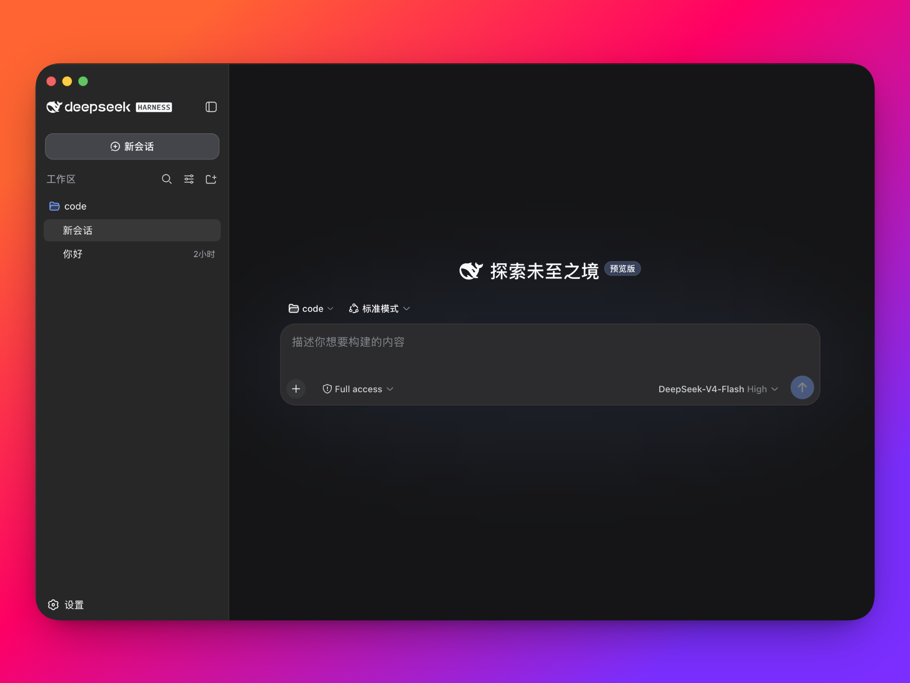

# DeepSeek Harness Desktop

中文 | [English](README.en.md)

将 DeepSeek Harness 打包成开箱即用的桌面应用。

DeepSeek 官方目前通过命令行启动本地 Web UI。这个项目在官方 DeepSeek Harness 的基础上增加了 Electron 桌面外壳，负责启动和管理本地 Harness 服务，让用户无需配置 Node.js 或执行命令，即可直接使用。

<a id="run"></a>

## 下载

| 平台 | 支持情况 |
| --- | --- |
| macOS Apple Silicon | 支持 |
| macOS Intel | 计划支持 |
| Windows x64 | 支持 |

前往 [deepseekdesktop.com](https://deepseekdesktop.com) 下载最新版本。

## 界面预览

<p align="center">
  
</p>

## 主要功能

- 将 DeepSeek Harness 打包为原生桌面应用
- 自动启动和管理本地 Harness 服务
- 无需手动安装 Node.js 或运行命令
- 支持系统托盘驻留
- 针对 macOS 和 Windows 优化窗口与界面
- 保留官方 Harness 的插件化能力和本地 Web UI
- 应用数据和 Harness 服务均运行在本地

## 与官方项目的关系

本项目基于 [deepseek-ai/deepseek-harness](https://github.com/deepseek-ai/deepseek-harness) 构建。

DeepSeek Harness 的核心能力、插件系统和 Web UI 来自官方项目。本项目主要负责：

- Electron 桌面封装
- 本地服务生命周期管理
- 桌面窗口和系统托盘集成
- macOS、Windows 安装包构建与发布
- 桌面环境下的界面适配

如果你希望通过命令行运行 Harness，或者参与核心功能开发，请优先查看官方仓库。

<a id="run-from-source"></a>

## 开发

桌面端代码位于：

```text
apps/desktop
```

安装依赖并启动桌面应用：

```sh
pnpm install
pnpm run dev:desktop
```

## 社区交流

可选择常用的平台参与讨论，交流使用问题、插件开发和项目进展。

<table>
  <thead>
    <tr>
      <th align="center">微信群</th>
      <th align="center">QQ群</th>
    </tr>
  </thead>
  <tbody>
    <tr>
      <td align="center"></td>
      <td align="center"></td>
    </tr>
  </tbody>
</table>

Discord：[加入 DeepSeek Harness Desktop 社区](https://discord.gg/TJeGqKRNM)

## License

本项目遵循 [MIT License](LICENSE)。

> 本项目是基于 DeepSeek Harness 构建的社区桌面版本，并非 DeepSeek 官方产品。
